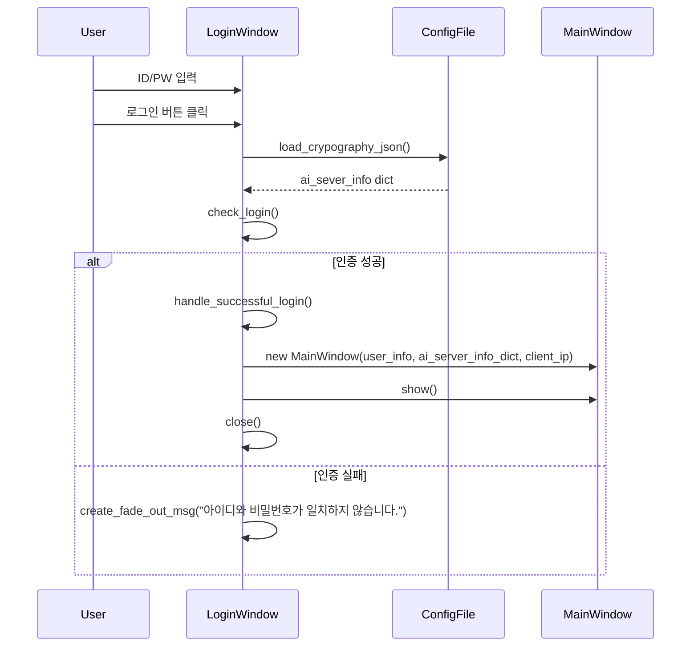
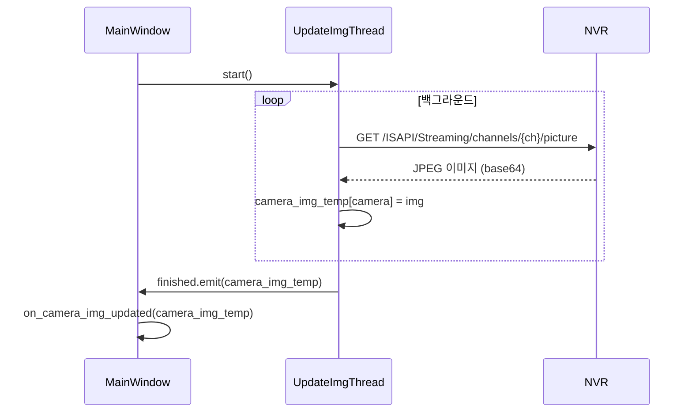
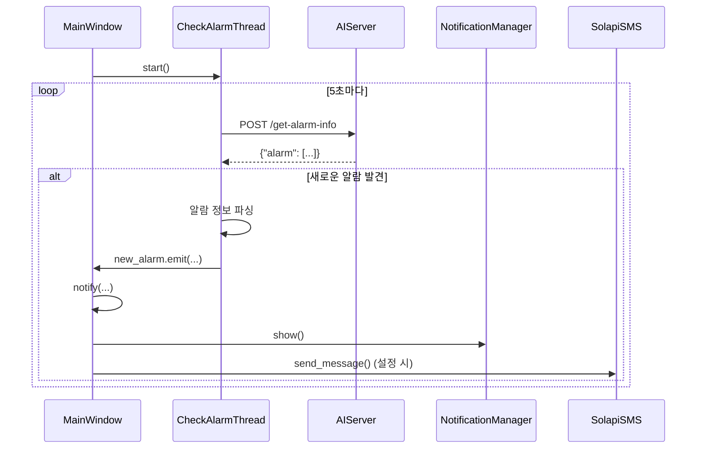
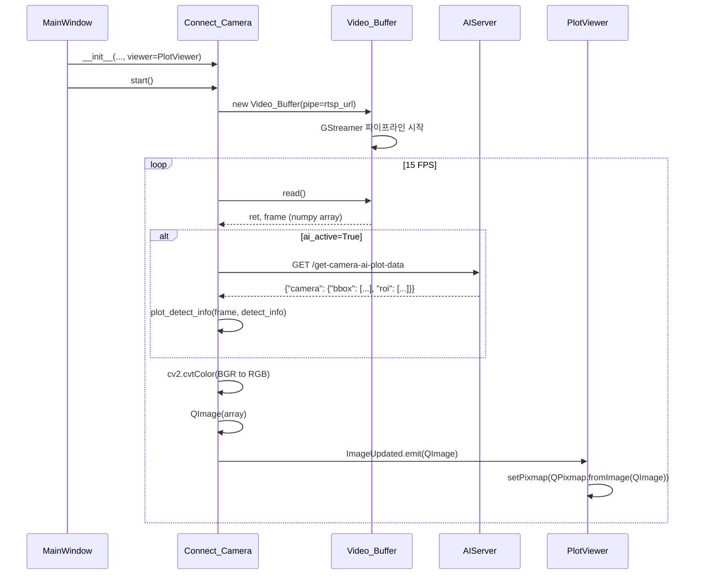
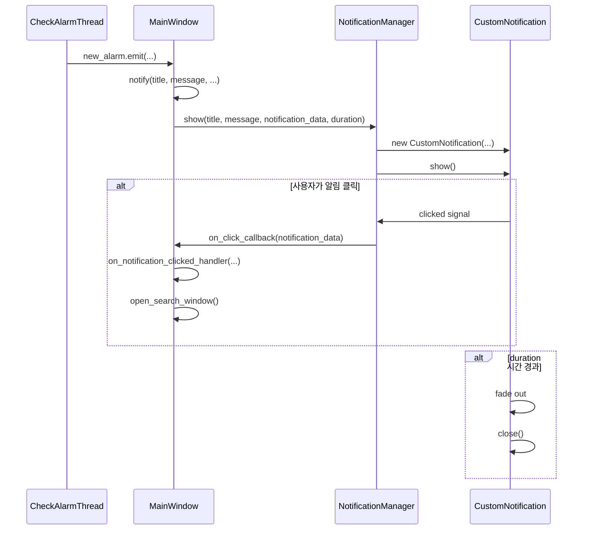
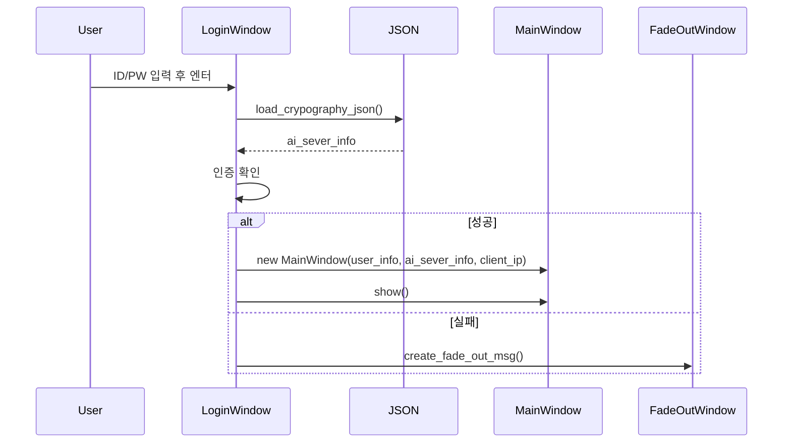
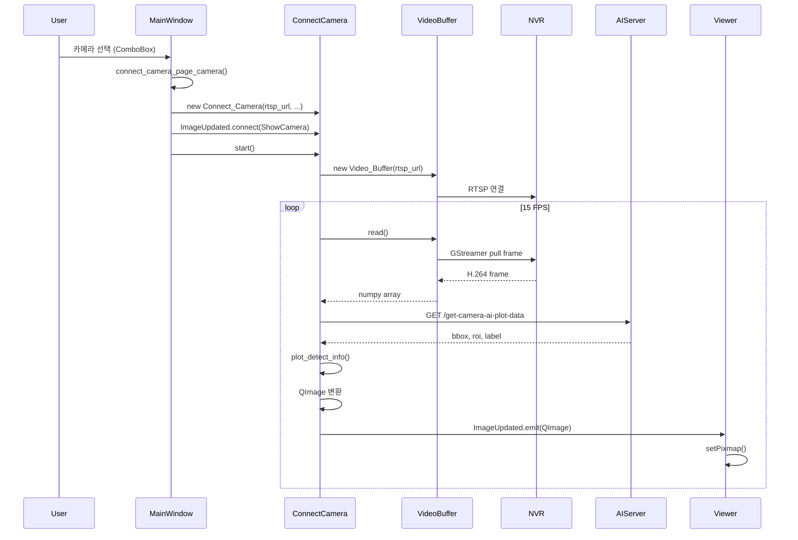
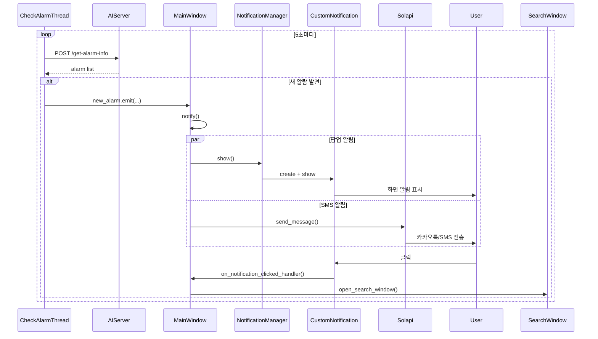

# UI Component Map - ui_v1.7.0

## 개요
이 문서는 MS-AI-Viewer의 핵심 컴포넌트 구조, Props/Signal 전달 방식, 데이터 흐름, 그리고 백엔드 API 통신을 상세히 분석합니다.

## 전체 컴포넌트 의존성 그래프

```mermaid
graph TB
    subgraph "애플리케이션 엔트리"
        Main[main 함수<br/>Line 2278]
    end

    subgraph "인증 레이어"
        Login[LoginWindow<br/>QDialog<br/>Line 351]
    end

    subgraph "메인 UI"
        MainWin[MainWindow<br/>QMainWindow<br/>Line 480]

        subgraph "UI 페이지 (StackedWidget)"
            CameraPage[카메라 뷰어 페이지]
            SettingPage[설정 페이지]
            AdminPage[관리자 페이지]
            ServerPage[서버 설정 페이지]
        end
    end

    subgraph "백그라운드 스레드 (QThread)"
        UpdateImgThread[UpdateCameraImageThread<br/>Line 79]
        CheckAlarm[CheckAlarmThread<br/>Line 137]
        ConnectCam[Connect_Camera<br/>utils.py:300]
        ConnectPlay[Connect_Playback<br/>utils.py:420]
    end

    subgraph "비디오 처리"
        VideoBuffer[Video_Buffer<br/>utils.py:50<br/>GStreamer]
        RtspReader[RtspVideoReader<br/>utils.py:196<br/>OpenCV]
    end

    subgraph "UI 위젯"
        PlotViewer[Plot_Camera_Viewer<br/>QLabel<br/>utils.py:478]
        FadeOut[FadeOutWindow<br/>utils.py:575]
        CustomNoti[CustomNotification<br/>utils.py:927]
        NotiManager[NotificationManager<br/>utils.py:1181]
    end

    subgraph "외부 윈도우 (ui/ 모듈)"
        AISettingWin[AI 설정 창<br/>utils_ai_setting_window.py]
        ScheduleWin[스케줄 설정 창<br/>utils_schedule_window.py]
        ObjectSettingWin[객체 설정 창<br/>utils_object_setting_window.py]
        SearchWin[검색 창<br/>utils_search_window.py]
        LabelingWin[라벨링 창<br/>utils_labeling_window.py]
        ServerSettingWin[서버 설정 창<br/>utils_server_setting_window.py]
    end

    subgraph "외부 시스템"
        NVR[NVR 서버<br/>RTSP + HTTP]
        AIServer[AI 서버<br/>REST API]
        SolapiSMS[Solapi<br/>SMS/카카오톡]
        EmailSMTP[SMTP 서버<br/>이메일]
    end

    Main -->|show| Login
    Login -->|check_login 성공| MainWin
    Login -->|load JSON| ConfigFile[(ai_sever_info.json<br/>암호화됨)]

    MainWin -->|초기화| UpdateImgThread
    MainWin -->|초기화| CheckAlarm
    MainWin -->|화면 전환| CameraPage
    MainWin -->|화면 전환| SettingPage
    MainWin -->|화면 전환| AdminPage

    CameraPage -->|connect_camera| ConnectCam
    ConnectCam -->|비디오 소스| VideoBuffer
    ConnectCam -->|ImageUpdated Signal| PlotViewer

    UpdateImgThread -->|finished Signal| MainWin
    CheckAlarm -->|new_alarm Signal| MainWin

    MainWin -->|notify 호출| NotiManager
    NotiManager -->|생성| CustomNoti
    MainWin -->|create_fade_out_msg| FadeOut

    MainWin -->|open_ai_setting_window| AISettingWin
    MainWin -->|open_schedule_window| ScheduleWin
    MainWin -->|open_object_setting_window| ObjectSettingWin
    MainWin -->|open_search_window| SearchWin
    MainWin -->|open_labeling_window| LabelingWin
    MainWin -->|open_server_setting_window| ServerSettingWin

    VideoBuffer -->|RTSP 스트림| NVR
    UpdateImgThread -->|HTTP 요청| NVR
    ConnectCam -->|HTTP GET 요청| AIServer
    CheckAlarm -->|HTTP POST 요청| AIServer
    MainWin -->|알람 발생 시| SolapiSMS
    MainWin -->|알람 발생 시| EmailSMTP

    style Main fill:#e1f5ff
    style Login fill:#fff3cd
    style MainWin fill:#d4edda
    style CheckAlarm fill:#f8d7da
    style UpdateImgThread fill:#f8d7da
    style ConnectCam fill:#f8d7da
    style VideoBuffer fill:#d1ecf1
    style NotiManager fill:#e7e7e7
```



## 컴포넌트 상세 분석

### 1. 애플리케이션 엔트리 - main()

**위치**: [main.py:2278](main.py#L2278)

**역할**: 애플리케이션 초기화 및 로그인 창 표시

```python
def main():
    app = QApplication(sys.argv)
    login_window = LoginWindow()
    login_window.show()
    sys.exit(app.exec())
```

**데이터 흐름**:
1. QApplication 생성
2. LoginWindow 인스턴스 생성
3. 로그인 창 표시

---

### 2. LoginWindow (QDialog)

**위치**: [main.py:351-479](main.py#L351)

**상속**: `QDialog` → `Ui_login_windows` ([ui/ui_login.py](ui/ui_login.py))

**Props (생성자 파라미터)**: 없음

**주요 속성**:
- `client_ip`: 외부 IP (api.ipify.org에서 가져옴)
- `local_ip`: 로컬 IP
- `ai_sever_info`: 암호화된 설정 파일 로드 결과
- `ui_login`: Ui_login_windows 인스턴스

**Signal/Slot 연결**:
```python
self.ui_login.login_bn.clicked.connect(self.check_login)
```

**메서드**:
- `check_login()`: 사용자 인증 확인 ([Line 408](main.py#L408))
- `handle_successful_login(user_info)`: 로그인 성공 처리 ([Line 423](main.py#L423))
- `create_fade_out_msg(msg)`: 에러 메시지 표시 ([Line 442](main.py#L442))

**데이터 흐름**:


**API 통신**:
- 외부 IP 조회: `GET https://api.ipify.org?format=text`

---

### 3. MainWindow (QMainWindow)

**위치**: [main.py:480-2207](main.py#L480)

**상속**: `QMainWindow` → `Ui_MainWindow` ([ui/ui_main.py](ui/ui_main.py))

**Props (생성자 파라미터)**:
```python
def __init__(self, user_info, ai_server_info_dict, client_ip)
```
- `user_info` (str): 로그인한 사용자 ID
- `ai_server_info_dict` (dict): AI 서버 및 NVR 설정 정보
- `client_ip` (str): 클라이언트 IP (형식: "외부IP@로컬IP")

**주요 속성**:
- `ui_main`: Ui_MainWindow 인스턴스
- `notification_manager`: NotificationManager 인스턴스
- `check_alarm_thread`: CheckAlarmThread 인스턴스
- `update_camera_img_thread`: UpdateCameraImageThread 인스턴스
- `camera_page_worker`: Connect_Camera 인스턴스
- `admin_flag`: 관리자 권한 플래그

**초기화 흐름** ([Line 481-514](main.py#L481)):
```python
def __init__(self, user_info, ai_server_info_dict, client_ip):
    super(MainWindow, self).__init__()

    self.ai_server_info_dict = ai_server_info_dict
    self.client_ip = client_ip

    self.ui_main = Ui_MainWindow()
    self.ui_main.setupUi(self)

    self.notification_manager = NotificationManager(...)

    self.setup_init_GUI()         # GUI 초기화
    self.setup_slot_connect()     # Signal/Slot 연결
    self.setup_event_filters()    # 이벤트 필터

    # 알람 체크 스레드 시작
    self.check_alarm_thread = CheckAlarmThread(self.ai_server_info_dict)
    self.check_alarm_thread.new_alarm.connect(self.notify)
    self.check_alarm_thread.start()
```

**주요 Signal/Slot 연결** ([Line 967-1028](main.py#L967)):

| UI 위젯 | 이벤트 | 핸들러 메서드 |
|---------|--------|---------------|
| `shutdown_bnt` | clicked | `back_window()` |
| `camera_bnt` | clicked | `switch_main_display_to_camera()` |
| `setting_bnt` | clicked | `switch_main_display_to_setting()` |
| `admin_bnt` | clicked | `switch_main_display_to_admin_2()` |
| `nvr_add_bnt` | clicked | `add_nvr_server()` |
| `ai_server_add_bnt` | clicked | `add_ai_server()` |
| `ai_server_table` | itemDoubleClicked | `clicked_switch_ai_viewer()` |
| `camera_page_name_box` | currentTextChanged | `connect_camera_page_camera()` + `set_camera_page_viewer()` |
| `camera_page_detect_add_bnt` | clicked | `camera_page_add_detect_type()` |
| `search_memu_bnt` | clicked | `open_search_window()` |
| `camera_schedule_bnt` | clicked | `open_schedule_window()` |
| `labeling_bnt` | clicked | `open_labeling_window()` |

**핵심 메서드**:

#### 화면 전환
- `switch_main_display_to_camera()` ([Line 1666](main.py#L1666)): 카메라 뷰어 페이지로 전환
- `switch_main_display_to_setting()` ([Line 1692](main.py#L1692)): 설정 페이지로 전환
- `switch_main_display_to_admin()` ([Line 1707](main.py#L1707)): 관리자 페이지로 전환
- `switch_ai_viewer(ai_server_ip, ai_server_port)` ([Line 1199](main.py#L1199)): 특정 AI 서버 뷰어로 전환

#### 카메라 연결 및 표시
- `connect_camera_page_camera(camera_name)` ([Line 1443](main.py#L1443)): 카메라 연결
- `setup_camera_viewer()` ([Line 1340](main.py#L1340)): 카메라 뷰어 초기화
- `ShowCamera(view, frame)` ([Line 1508](main.py#L1508)): QLabel에 프레임 표시

#### 알람 처리
- `notify(title, message, camera_name, alarm_time, ai_type, ...)` ([Line 564](main.py#L564)): 알람 알림
- `on_notification_clicked_handler(notification_data)` ([Line 735](main.py#L735)): 알림 클릭 핸들러

#### 서버 관리
- `add_nvr_server()` ([Line 1891](main.py#L1891)): NVR 추가
- `save_nvr_server()` ([Line 1926](main.py#L1926)): NVR 저장
- `add_ai_server()` ([Line 1863](main.py#L1863)): AI 서버 추가
- `save_ai_server()` ([Line 1820](main.py#L1820)): AI 서버 저장

---

### 4. UpdateCameraImageThread (QThread)

**위치**: [main.py:79-135](main.py#L79)

**상속**: `QThread`

**Props (생성자 파라미터)**:
```python
def __init__(self, ai_server_camera_info_dict, ai_server_info_dict)
```

**Signal**:
- `finished = Signal(dict)`: 카메라 이미지 업데이트 완료 시 발생

**역할**: NVR에서 주기적으로 카메라 스냅샷 이미지를 가져옴

**데이터 흐름**:


**API 통신**:
```python
# Line 107-124
for camera in cameras:
    url = f"http://{nvr_ip}/ISAPI/Streaming/channels/{camera['ch']}/picture"
    response = requests.get(url, auth=HTTPBasicAuth(nvr_id, nvr_pw))
    img = cv2.imdecode(np.frombuffer(response.content, np.uint8), cv2.IMREAD_COLOR)
```

---

### 5. CheckAlarmThread (QThread)

**위치**: [main.py:137-237](main.py#L137)

**상속**: `QThread`

**Props (생성자 파라미터)**:
```python
def __init__(self, ai_server_info_dict)
```

**Signal**:
- `new_alarm = Signal(str, str, str, str, str, str, str)`: 새로운 알람 발생 시
  - 파라미터: title, message, camera_name, alarm_time, ai_type, ai_server_ip, ai_server_port

**역할**: AI 서버에서 주기적으로 알람 이벤트를 폴링

**데이터 흐름**:


**API 통신**:
```python
# Line 165-180
url = f'http://{ai_server_ip}:{ai_server_port}/get-alarm-info'
data = {"msg": {"detect_type": enabled_types}}
response = requests.post(url, json=data, timeout=5).json()

# 응답 구조 (추정):
# {
#   "alarm": [
#     {
#       "camera_name": "카메라1",
#       "time": "2026-02-04 10:30:00",
#       "detect_type": "침입",
#       ...
#     }
#   ]
# }
```

---

### 6. Connect_Camera (QThread)

**위치**: [utils.py:300-419](utils.py#L300)

**상속**: `QThread`

**Props (생성자 파라미터)**:
```python
def __init__(self, pipe, host, port, camera_name, viewer,
             plot_bbox=True, plot_label=True, plot_roi=True,
             roi_thickness=1, ai_active=False, live_viewer_blcok_active=False)
```
- `pipe` (str): RTSP URL
- `host` (str): AI 서버 IP
- `port` (int): AI 서버 포트
- `camera_name` (str): 카메라 이름
- `viewer` (QLabel): 표시할 QLabel 위젯
- `plot_bbox/plot_label/plot_roi` (bool): 바운딩 박스, 라벨, ROI 표시 여부
- `ai_active` (bool): AI 정보 가져오기 활성화 여부

**Signal**:
- `ImageUpdated = Signal(QImage)`: 새 프레임 준비 시 발생
- `doubleClicked = Signal()`: 뷰어 더블 클릭 시

**역할**:
1. RTSP 스트림에서 프레임 읽기 (Video_Buffer 사용)
2. AI 서버에서 감지 정보 가져오기
3. 프레임에 바운딩 박스/라벨/ROI 그리기
4. QImage로 변환하여 UI 업데이트

**데이터 흐름**:


**API 통신**:
```python
# Line 384
self.back_url = f"http://{self.host}:{self.port}/get-camera-ai-plot-data"
receive_data = session.get(self.back_url, json={"msg": self.camera_name}).json()

# 응답 구조 (추정):
# {
#   "camera_name": {
#     "bbox": [[x1, y1, x2, y2, class_id, confidence], ...],
#     "roi": [[x1, y1], [x2, y2], ...],
#     "label": "침입"
#   }
# }
```

---

### 7. Video_Buffer

**위치**: [utils.py:50-195](utils.py#L50)

**역할**: GStreamer를 사용한 RTSP 비디오 스트리밍 및 버퍼링

**Props (생성자 파라미터)**:
```python
def __init__(self, pipe="video1", appsink_name="video_sink",
             resolution=(640,480), chg_fps_mode=False, fps=30)
```

**주요 메서드**:
- `start_gst(config)`: GStreamer 파이프라인 시작 ([Line 74](utils.py#L74))
- `read()`: 현재 프레임 읽기 ([Line 110](utils.py#L110))
- `on_message(bus, message)`: GStreamer 메시지 처리 (에러, EOS) ([Line 144](utils.py#L144))

**GStreamer 파이프라인**:
```
rtspsrc location=rtsp://{pipe} latency=10 buffer-mode=0 protocols=tcp
  → rtph264depay
  → h264parse
  → decodebin
  → videorate
  → videoscale (640x480)
  → videoconvert (BGR)
  → appsink (max-buffers=5, drop=true)
```

**연결 상태 관리**:
- `connection_status` (bool): RTSP 연결 상태
- 에러/EOS 메시지 수신 시 자동 재연결 시도

---

### 8. NotificationManager

**위치**: [utils.py:1181-end](utils.py#L1181)

**상속**: `QObject`

**Props (생성자 파라미터)**:
```python
def __init__(self, on_click_callback=None)
```
- `on_click_callback` (callable): 알림 클릭 시 호출할 콜백 함수

**주요 메서드**:
- `show(title, message, notification_data, duration)`: 알림 표시
- `close_all()`: 모든 알림 닫기

**역할**:
- CustomNotification 인스턴스 관리
- 여러 알림 동시 표시 (위치 자동 조정)
- 알림 클릭 이벤트 처리

**데이터 흐름**:


---

### 9. Plot_Camera_Viewer (QLabel)

**위치**: [utils.py:478-574](utils.py#L478)

**상속**: `QLabel`

**역할**: 카메라 프레임 표시 및 ROI 그리기 기능을 가진 커스텀 QLabel

**주요 메서드**:
- `paintEvent(event)`: 프레임 위에 ROI 폴리곤 그리기
- `mousePressEvent(event)`: 마우스 클릭으로 ROI 포인트 추가

**사용 예**:
```python
# MainWindow에서 사용
viewer = Plot_Camera_Viewer()
camera_worker = Connect_Camera(..., viewer=viewer)
camera_worker.ImageUpdated.connect(lambda img: self.ShowCamera(viewer, img))
camera_worker.start()
```

---

## 외부 윈도우 모듈 (ui/ 디렉토리)

다음 모듈들은 `ui/` 디렉토리에 포함되어 있으며, main.py에서 import하여 사용합니다.

### 1. AI 설정 창
**모듈**: [ui/utils_ai_setting_window.py](ui/utils_ai_setting_window.py) (23KB)
**UI 정의**: [ui/ui_ai_setting.py](ui/ui_ai_setting.py) ← [ui/ai_setting.ui](ui/ai_setting.ui) (Qt Designer)
**UI 클래스**: `Ui_Ai_Setting_Window`
**주요 클래스**: `Ai_setting_page_view(QLabel)` - 카메라 뷰어 위젯
**진입 함수**: `open_ai_setting_window(click, instance)`
**호출**: [main.py:1002](main.py#L1002)

### 2. 스케줄 설정 창
**모듈**: [ui/utils_schedule_window.py](ui/utils_schedule_window.py) (21KB)
**UI 정의**: [ui/ui_schedule.py](ui/ui_schedule.py) ← [ui/schedule.ui](ui/schedule.ui) (Qt Designer)
**UI 클래스**: `Ui_schedule_window`
**주요 클래스**: `SchedulePageView(QLabel)`, `ScheduleDialog(QDialog)`
**진입 함수**: `open_schedule_window(click, instance)`
**호출**: [main.py:1024](main.py#L1024)

### 3. 객체 설정 창
**모듈**: [ui/utils_object_setting_window.py](ui/utils_object_setting_window.py) (5KB)
**UI 정의**: [ui/ui_object_setting.py](ui/ui_object_setting.py) ← [ui/object_setting.ui](ui/object_setting.ui) (Qt Designer)
**UI 클래스**: `Ui_object_setting`
**주요 클래스**: `Object_settint_Dialog(QDialog)`
**진입 함수**: `open_object_setting_window(click, instance)`
**호출**: [main.py:1000](main.py#L1000)

### 4. 검색 창
**모듈**: [ui/utils_search_window.py](ui/utils_search_window.py) (46KB)
**UI 정의**: [ui/ui_search.py](ui/ui_search.py) ← [ui/search.ui](ui/search.ui) (Qt Designer)
**UI 클래스**: `Ui_Search_window`
**주요 클래스**: `SearchPageViewer(QLabel)`, `SearchDialog(QDialog)`
**진입 함수**: `open_search_window(click, instance)`
**호출**: [main.py:1023](main.py#L1023)

### 5. 라벨링 창
**모듈**: [ui/utils_labeling_window.py](ui/utils_labeling_window.py) (38KB)
**UI 정의**: [ui/ui_ai_labeling.py](ui/ui_ai_labeling.py) ← [ui/ai_labeling.ui](ui/ai_labeling.ui) (Qt Designer)
**UI 클래스**: `Ui_labeling_window`
**주요 클래스**: `Labeling_Viewer(QLabel)`, `LabelingDialog(QDialog)`
**진입 함수**: `open_labeling_window(click, instance)`
**호출**: [main.py:1025](main.py#L1025)

### 6. 서버 설정 창
**모듈**: [ui/utils_server_setting_window.py](ui/utils_server_setting_window.py) (20KB)
**UI 정의**: [ui/ui_server_setting.py](ui/ui_server_setting.py) ← [ui/server_setting.ui](ui/server_setting.ui) (Qt Designer)
**UI 클래스**: `Ui_server_setting_window`
**진입 함수**: `open_server_setting_window(click, instance)`
**호출**: [main.py:992](main.py#L992)

### 공통 인터페이스 패턴
```python
def open_xxx_window(click_event, main_window_instance):
    """
    Args:
        click_event: QPushButton.clicked 이벤트
        main_window_instance: MainWindow 인스턴스 (설정 읽기/쓰기용)

    Returns:
        None (새 QDialog 창을 표시)
    """
```

### UI 빌드 파이프라인
```
.ui 파일 (Qt Designer)
    ↓ pyside6-uic
ui_*.py (자동 생성 - 수동 편집 금지)
    ↓ import
utils_*.py (비즈니스 로직 구현)
    ↓ import
main.py (진입 함수 호출)
```

> **주의**: `ui_*.py` 파일은 Qt Designer `.ui` 파일에서 자동 생성됩니다. 이 파일을 직접 수정하면 `.ui` 파일 재컴파일 시 변경사항이 유실됩니다.

---

## 데이터 흐름 종합

### 1. 사용자 입력 처리 흐름

#### 로그인 플로우


#### 카메라 선택 및 표시 플로우


#### 알람 처리 플로우


### 2. 백엔드 API 통신 정리

#### NVR API

| 엔드포인트 | 메서드 | 요청 | 응답 | 사용 위치 |
|-----------|--------|------|------|-----------|
| `/ISAPI/Streaming/channels/{ch}/picture` | GET | - | JPEG 이미지 | UpdateCameraImageThread |
| `rtsp://{ip}:{port}/...` | RTSP | - | H.264 스트림 | Video_Buffer |

#### AI 서버 API

| 엔드포인트 | 메서드 | 요청 | 응답 | 사용 위치 |
|-----------|--------|------|------|-----------|
| `/get-alarm-info` | POST | `{"msg": {"detect_type": [...]}}` | `{"alarm": [...]}` | CheckAlarmThread:165 |
| `/get-camera-ai-plot-data` | GET | `{"msg": "camera_name"}` | `{"camera": {"bbox": [...], "roi": [...]}}` | Connect_Camera:384 |
| `/login-admin-page` | POST | `{"msg": "password"}` | `{"msg": true/false}` | MainWindow:1032 |

**기타 API** (추정, 코드에서 직접 확인 필요):
- 설정 저장/로드
- 스케줄 관리
- 라벨링 데이터 관리
- 카메라 정보 조회

#### 외부 서비스 API

**Solapi (SMS/카카오톡)**:
```python
# Line 605-631
from solapi import SolapiMessageService

message_service = SolapiMessageService(
    api_key="NCSV30HGFAONWEPN",
    api_secret="KTNWYZVICVQ7XU5AFUZGNC8OQXT9AACT"
)

kakao_option = KakaoOption(
    pf_id="KA01PF251028000707180RUlDmOmEIHl",
    template_id="KA01TP251029053533686cVW9f2fory3",
    variables={
        "#{detect_type}": ai_type,
        "#{camare_name}": camera_name,
        "#{current_time}": current_time
    }
)

message = RequestMessage(
    from_="01084461617",
    to=phone_num,
    kakao_options=kakao_option,
)

response = message_service.send(message)
```

**IP 조회**:
```python
# Line 357
client_ip = requests.get("https://api.ipify.org?format=text").text
```

---

## Props 전달 방식 요약

PySide6(Qt)는 React의 Props 개념 대신 다음 방식을 사용합니다:

### 1. 생성자 파라미터
```python
# 부모 위젯
main_window = MainWindow(user_info="admin", ai_server_info_dict={...}, client_ip="1.2.3.4")

# 자식 스레드
camera_worker = Connect_Camera(
    pipe="rtsp://...",
    host="192.168.1.100",
    viewer=self.camera_viewer_label,
    plot_bbox=True
)
```

### 2. Signal/Slot 메커니즘 (이벤트 기반 통신)
```python
# 자식 → 부모 통신
self.check_alarm_thread.new_alarm.connect(self.notify)

# 형제 간 통신 (부모를 통해)
self.camera_worker.ImageUpdated.connect(lambda img: self.ShowCamera(viewer, img))
```

### 3. 공유 객체 참조
```python
# 설정 딕셔너리를 여러 컴포넌트에서 공유
self.ai_server_info_dict = ai_server_info_dict
self.check_alarm_thread = CheckAlarmThread(self.ai_server_info_dict)
self.update_img_thread = UpdateCameraImageThread(camera_info, self.ai_server_info_dict)
```

### 4. 전역 상수
```python
# main.py:67-75
NOTICE_DURATION = {0: 3000, 1: 5000, ...}
ALARM_TYPE_DIC = {2: "침입", 1: "배회", ...}
```

---

## 컴포넌트 의존성 레벨

```
Level 0 (최상위):
  - main()

Level 1 (인증):
  - LoginWindow

Level 2 (메인 UI):
  - MainWindow

Level 3 (페이지 및 관리자):
  - CameraPage (MainWindow의 일부)
  - SettingPage
  - AdminPage
  - NotificationManager

Level 4 (백그라운드 작업):
  - UpdateCameraImageThread
  - CheckAlarmThread
  - Connect_Camera (카메라 연결 시 생성)

Level 5 (비디오 처리):
  - Video_Buffer (Connect_Camera가 생성)
  - RtspVideoReader (대체 구현)

Level 6 (UI 위젯):
  - Plot_Camera_Viewer
  - CustomNotification
  - FadeOutWindow

Level 7 (외부 시스템):
  - NVR (RTSP + HTTP)
  - AI Server (REST API)
  - Solapi (SMS/카카오톡)
  - SMTP (이메일)
```

---

## 주요 데이터 구조

### ai_sever_info.json (암호화됨)
```json
{
  "USER": {
    "admin": "password123",
    "user1": "password456"
  },
  "NVR": {
    "192.168.1.100": {
      "id": "admin",
      "pw": "12345",
      "cameras": [
        {
          "name": "카메라1",
          "ch": 101,
          "rtsp_url": "rtsp://192.168.1.100:554/..."
        }
      ]
    }
  },
  "AI_SERVER": {
    "192.168.1.200": {
      "port": 8000,
      "cameras": ["카메라1", "카메라2"]
    }
  },
  "SETTING": {
    "notice": {
      "active": true,
      "duration": 2
    },
    "sms": {
      "active": true,
      "user": {
        "010-1234-5678": {
          "intrusion": true,
          "loitering": false,
          "falldown": true
        }
      }
    }
  }
}
```

---

## 다음 단계

이 컴포넌트 맵을 기반으로:
1. **기술 부채, 성능 병목, 개선 포인트 도출** (UI_UPDATE_STRATEGY.md 참조)
2. **API 명세 문서화** (AI 서버 엔드포인트 전체)
3. **ui/ 모듈 코드 품질 개선** (타입 힌팅, 문서화, 중복 코드 제거)
